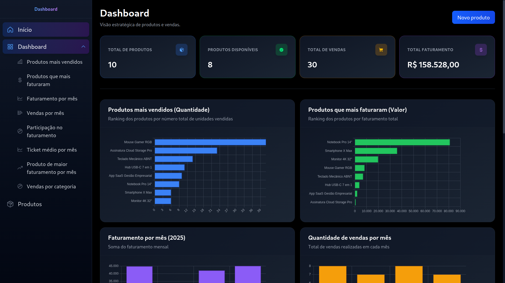

# Dashboard de Produtos

Desafio técnico de dashboard administrativo de produtos em React + TypeScript. CRUD completo, gráficos de vendas e faturamento, com API mock em Node + Express.

**Stack:** React 19, Vite, TypeScript, Zustand, Tailwind CSS, Chart.js, Node, Express.



---

## Como executar

O frontend consome a API em `http://localhost:3001`. A API precisa estar rodando antes (ou subir os dois juntos):

**Opção 1 – Tudo de uma vez (recomendado)**  
Na raiz do projeto:
```bash
npm install
npm run dev
```
Isso sobe a API (porta 3001) e o frontend (Vite, porta 5173).

**Opção 2 – Em terminais separados**  
1. Terminal 1 – API: `cd api-mock && npm start`  
2. Terminal 2 – Frontend: `cd frontend && npm run dev`

A rota `/` exibe uma LandingPage com esta documentação. O Dashboard está em `/products` e a lista de produtos em `/lista`.

---

## Deploy no Railway (front + back)

### Pré-requisitos

- Conta no [Railway](https://railway.app)
- Repositório no GitHub
- O frontend já tem o script `start` e a dependência `serve` para servir os arquivos estáticos

### Passo a passo

**1. Criar projeto no Railway**

- Acesse [railway.app](https://railway.app) e faça login (GitHub).
- Clique em **New Project**.
- Escolha **Deploy from GitHub repo**.
- Conecte o repositório e selecione o branch (ex: `deploy`).

**2. Serviço da API**

- O primeiro serviço será a API. Em **Settings**:
  - **Root Directory:** `api-mock`
  - **Build Command:** `npm run build`
  - **Start Command:** `npm start`
- Em **Variables:** não precisa configurar nada para começar (o CORS aceita `.railway.app` e `localhost`).
- Em **Networking**, clique em **Generate Domain** e anote a URL (ex: `https://xxx.up.railway.app`).

**3. Serviço do Frontend**

- Clique em **+ New** no projeto e escolha **Empty Service** ou **Deploy from same repo**.
- Em **Settings**:
  - **Root Directory:** `frontend`
  - **Build Command:** `npm run build`
  - **Start Command:** `npm start`
- Em **Variables**, adicione:
  - **VITE_API_URL** = URL da API (ex: `https://xxx.up.railway.app` da etapa 2)
- Em **Networking**, clique em **Generate Domain** e anote a URL do frontend.

**4. Verificar**

- Abra a URL do frontend no navegador.
- O dashboard deve carregar os dados da API.

**5. Rodar local apontando para a API no Railway**

- Crie um arquivo `frontend/.env.local` com:
  ```
  VITE_API_URL=https://sua-api.up.railway.app
  ```
- Rode `npm run dev` no frontend. O CORS já aceita `localhost`.

---

## Requisitos atendidos

| Requisito | Implementação |
|-----------|---------------|
| CRUD completo de produtos | Create, Read, Update, Delete em `productsService.ts` e `productsStore.ts`. Modais em `ProductCreateModal`, `ProductEditModal`, `ProductDeleteModal`. Formulário em `ProductFormFields`. |
| Dashboard com gráficos | 8 gráficos em `ProductsCharts.tsx` consumindo `useChartData.ts`. Cards de estatísticas em `StatsCards.tsx`. |
| Filtros | Busca por nome e status em `ProductsFilters.tsx`. Parâmetros sincronizados na URL (`?search=&status=`). |
| API mock REST | Endpoints `/products` (GET, POST, PUT, DELETE) e `/sales` (GET) em `api-mock/`. Controllers, rotas e validação de payload. |
| Gerenciamento de estado | Zustand em `productsStore.ts` e `salesStore.ts`. |
| TypeScript | Tipagem em todo o frontend e API. Interfaces em `services/types.ts` e `api-mock/types.ts`. |
| Listagem | Tabela responsiva em `ProductsTable.tsx` com `DynamicTable` reutilizável. |
| Tratamento de erros | `ErrorMessage` com retry, `Loader` durante operações, `EmptyState` para listas vazias. |

---

## Decisões técnicas

| Tecnologia | Motivo |
|------------|--------|
| **Zustand** | Simplicidade, sem boilerplate. Adequado para estado global leve comparado a Redux ou Context API. |
| **Tailwind CSS** | Desenvolvimento ágil, tema escuro consistente, utilitários para layout responsivo. |
| **Chart.js** | Biblioteca madura e adequada para gráficos de dados tabulares (barras, pizza, linhas). |
| **Estrutura feature-based** | Organização por features (`products`, `sidebar`) facilita manutenção e escalabilidade. Componentes compartilhados em `shared/`. |
| **Filtros na URL** | Parâmetros `search` e `status` em `searchParams` permitem links compartilháveis e uso do botão Voltar do navegador. |

---

## Diferenciais e proatividade

- **8 gráficos:** Produtos mais vendidos (quantidade), produtos que mais faturaram, faturamento por mês, vendas por mês, participação no faturamento total, ticket médio por mês, distribuição do produto de maior faturamento ao longo dos meses, vendas por categoria.
- **Navegação por âncoras:** Sidebar com subitens que levam diretamente a cada gráfico no dashboard (`#chart-*`).
- **Duas experiências de CRUD:** Formulário inline no dashboard (`/products?mode=form`) e modais na lista de produtos (`/lista`).
- **Componentes reutilizáveis:** `DynamicTable`, `ConfirmModal`, `ProductFormFields`, `Modal`, `StatCard`, `ChartContainer`.
- **Cards de estatísticas:** Total de produtos, produtos disponíveis, total de vendas e faturamento total.

---

## Estrutura do projeto

```
dashboard-produtos/
├── frontend/
│   └── src/
│       ├── config/          # Chart.js, etc.
│       ├── features/
│       │   ├── products/    # Componentes, hooks e modais de produtos
│       │   └── sidebar/     # Itens do menu
│       ├── pages/           # LandingPage, Products, ProductsListPage
│       ├── routes/          # AppRoutes
│       ├── services/        # httpClient, productsService, salesService
│       ├── shared/          # Componentes reutilizáveis
│       └── store/           # Zustand (productsStore, salesStore)
└── api-mock/
    └── src/
        ├── controllers/
        ├── data/            # products.ts, sales.ts
        ├── routes/
        └── types.ts
```
